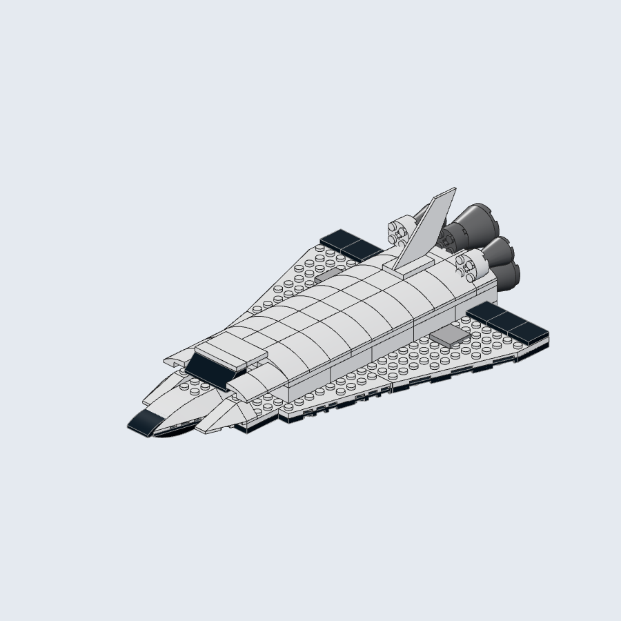
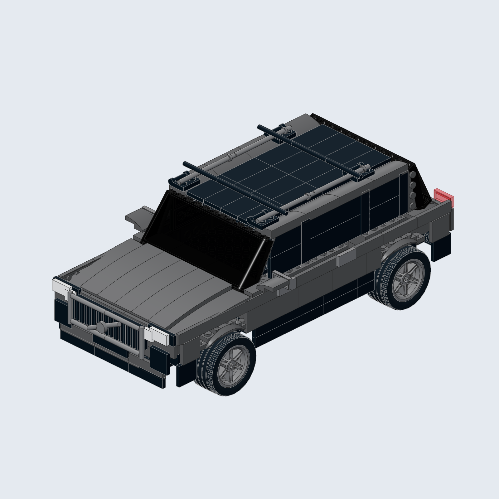

# Bricksmith

**Turn an image or an idea into a LEGO-style 3D model with your AI agent.**

Bricksmith is a skill for OpenClaw and Astra through Codex. Your agent interprets the subject and designs the model; local tools provide the full official LDraw community parts library, real part geometry, multi-angle rendering and editable exports.

## Examples

These images are renders of models assembled from actual LDraw parts.

### Space shuttle

**124 pieces · 23 distinct part types.** Curved slopes, wedge wings, a thin tail and round engines. The [scene and authoring source](examples/catalog/) are included so you can reproduce and adapt it.



### Volvo-inspired SUV

**301 pieces · 26 distinct part types.** A photo-inspired interpretation with dark glazing, curved body panels, roof bars, a diagonal grille detail and detailed wheels. Hidden surfaces were inferred during modeling.



[Example-image credits and geometry provenance](docs/examples/ATTRIBUTION.md).

## How it works

1. **Interpret the subject.** Start with a reference image or text description, choose a scale and identify the defining shapes.
2. **Choose parts.** Search the catalog and inspect real slopes, wedges, windows, wheels and other specialized geometry.
3. **Assemble and refine.** Place and rotate parts, check the scene, then inspect renders from six angles and revise the model.
4. **Export.** Deliver previews, an editable LDraw model, a parts inventory and the geometry dependencies needed to open it.

The current host agent supplies the design and reasoning. Catalog lookup, geometry checks, rendering and export run locally through deterministic tools.

## Install and use

- **[OpenClaw instructions](references/openclaw.md)** — install the skill for your chosen agent, prepare the local tools and run a task.
- **[Astra instructions](references/astra.md)** — set up the skill in Codex and invoke `$bricksmith-models`.
- **[Shared prerequisites](references/setup.md)** — Node.js 22.12+, npm, Python 3 for library extraction and an installed Chromium/Google Chrome for PNG renders.

For OpenClaw:

```sh
openclaw skills install git:herval/bricksmith@main --agent YOUR_AGENT
```

Replace `YOUR_AGENT` with your agent ID, then follow the host guide to prepare the tools and verify skill discovery. Your host's normal account, usage limits and permissions apply.

## Example request

> Use bricksmith-models to turn this car into a LEGO-style 3D model. Use real catalog parts, inspect it from several angles, and deliver PNG previews, an editable LDraw file and the parts inventory. Explain inferred surfaces and unverified physical connections.

## Outputs and validation

Each model can be exported with:

- Six PNG views: front, back, left, right, top and isometric.
- `scene.json` and an editable `model.ldr`.
- A parts inventory in `inventory.csv`.
- A geometry-validation report and the attribution-preserving LDraw dependency subset.

Validation covers part references, colors, rigid transforms, dependency integrity and geometric bounds. **Physical connections, collisions, stability and commercial part/color availability require separate verification.** TEXMAP rendering is currently unsupported; texture-mapped selections and missing upstream dependencies produce explicit errors.

## Repository guide

- [`SKILL.md`](SKILL.md) — the agent's design → inspect → revise → export workflow.
- [`references/`](references/) — host setup and model-authoring guidance.
- [`tools/`](tools/) and [`TOOLS.md`](TOOLS.md) — local helpers, CLI/API and scene-format reference.
- [`examples/catalog/`](examples/catalog/) — a reproducible scene and authoring source.
- [`tests/`](tests/) and [`scripts/`](scripts/) — helper tests and render/export verification.
- [Third-party notices](THIRD_PARTY_NOTICES.md) — source attribution and licenses.
